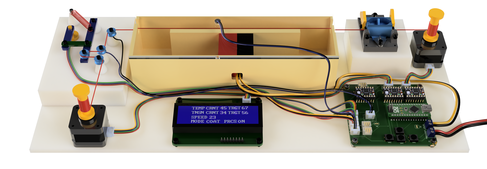

# Smart-Sensing-Thread-Factory

<p align="center">
  
</p>

## Overview

This project focuses on automating the thread production process using a combination of sensors and stepper motors. By implementing PID control, the system can maintain optimal tension, temperature, and conductivity, ensuring consistent thread quality throughout the manufacturing process.
See the research paper for more details: [Research Paper Link](https://github.com/egeozgul/Smart-Sensing-Thread-Factory/blob/main/Thread_Coating_Factory_Paper.pdf) 

## Contents

- **PCB_productionFiles**: This folder contains all the necessary PCB design files required for creating the electronic boards that drive the system. The PCBs connect the microcontroller to the sensors and motors, enabling accurate monitoring and control.
  
- **cartridgeDesignFiles**: Inside this folder, you will find the 3D printable designs for various mechanical components, particularly the thread cartridge system. These parts can be printed using a 3D printer and are crucial for holding and guiding the thread during production.

- **firmwareSourceCode**: This directory includes the firmware for the microcontroller, which handles the overall operation of the system. The firmware reads sensor data, controls the stepper motors, adjusts system settings via a user interface, and maintains optimal conditions using PID control.

## Setup

1. Clone the repository:
   ```bash
   git clone https://github.com/egeozgul/Smart-Sensing-Thread-Factory.git

2. Assemble the hardware according to the instructions, including printing the 3D parts from the cartridgeDesignFiles and producing the PCBs from the PCB_productionFiles.

3. Upload the firmware to your microcontroller using the Arduino IDE, ensuring that all components are connected properly.
